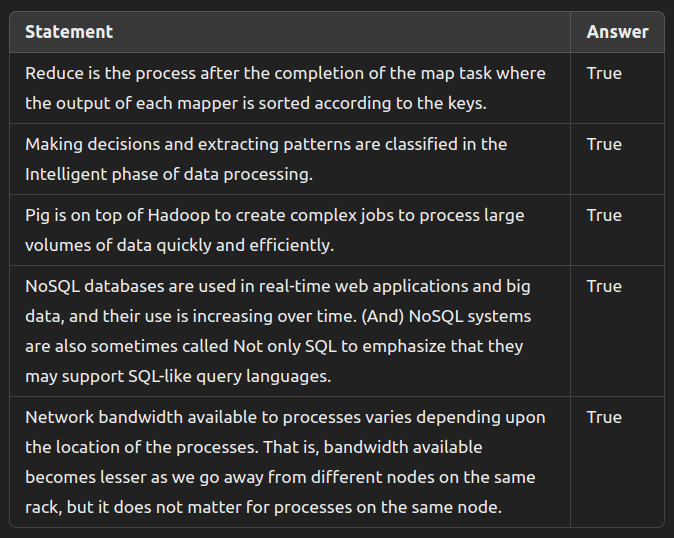
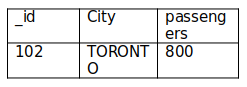
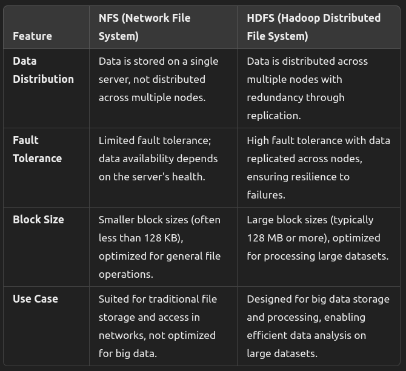
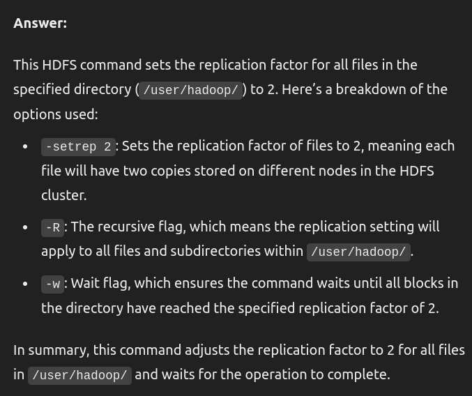
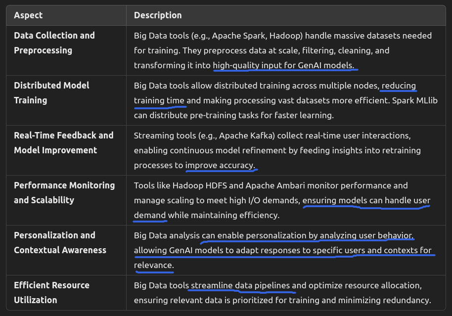
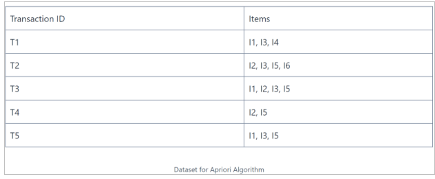

Big Data – Fall 2023
======================


Question 1 
---------------

``a)`` Other than volume, veracity, velocity, value, and variety. List three other Vs related to Big Data Analysis.

```Answer::``` Viability, Validity, Volatility


``b)`` The ___________________ is the first citizen in the object oriented paradigm.


```Answer::``` Object


``c)`` The objective of Big data analysis is combined in SPAS, where SPAS is acronyms of:

```Answer::``` Scalability, Performance, Availability, Security


``d)`` The main 2 components that Hadoop ecosystem initially was built on are:

```Answer::``` HDFS, MapReduce


Question 2
---------------




Question 3
---------------

For the following MongoDB collection, we inserted

```
db.city.insertMany( [
    { _id: 100, city: "Toronto", passengers: 700},
    { _id: 101, city: "toronto", passengers:300}
])
```

``a`` Add a new record with the following values:



``Answer`` 

```
db.city.insertOne({ _id: 102, city: "TORONTO", passengers: 800 })
```

``b`` After the insertion, what will the following command retrieve?

```
db.city.find({ name: { $regex: "(?i)t(?i)oronto" } })
```

``Answer``  Since the command is querying on a field name that doesn’t exist in the collection (which uses city instead), it will not retrieve any documents from the city collection. The command would need to reference the city field for results.

Corrected command for the intended result:

```
db.city.find({ city: { $regex: "(?i)t(?i)oronto" } })
```

This corrected command would retrieve all documents with the city name "Toronto" in any case variation, returning

```
{ _id: 100, city: "Toronto", passengers: 700 }
{ _id: 101, city: "toronto", passengers: 300 }
{ _id: 102, city: "TORONTO", passengers: 800 }
```

Question 4
---------------




Question 5
---------------
For the following Code Tester.java
```java
package com.hadoop;  
import java.io.IOException;   
import org.apache.pig.EvalFunc;  
import org.apache.pig.data.Tuple;  
public class Tester extends EvalFunc<String>   {  
    public String exec(Tuple input) throws IOException {    
        if (input == null || input.size() == 0)
       Object object = input.get(0);
        int i = (Integer) object;    
        return null;    
         if (i<=1)
	    return false;
	    for (int j = 2; j<= i/2; j++)
	    {
	        if (i%j==0)
	        return false;
	    }
	 return true;
    
            }  
}  

```

``a`` We have created Jar file based on the Tester.java, that is NumTester.jar, now, using pig command, register the jar file. [2 marks]

```Answer:```  

```
REGISTER 'NumTester.jar';
```

``b`` What is the output of running the following code: [2 marks]

```
A = LOAD 'pigsample' AS (age:int, name:chararray);
B = FOREACH A GENERATE com.hadoop.Tester(name);
DUMP B;
```

Where pigsample contains

```css
1, Maria
10, Mark
20, Todd
19, Josh
```

```Answer```

Since the Tester function is passed the age field (an integer) to check for primality, it will perform the following checks:

* For `age = 1`: Output is **false** (1 is not a prime number).
* For `age = 10`: Output is **false** (10 is not a prime number).
* For `age = 20`: Output is **false** (20 is not a prime number).
* For `age = 19`: Output is **true** (19 is a prime number).

Thus, the output of `DUMP B`; will be:

```
(false)
(false)
(false)
(true)
```


```c``` What is the purpose of the Tester.java (The functionality)? [2 marks]

```Answer``` The purpose of Tester.java is to check if a given integer is a prime number. It returns true if the integer is prime (only divisible by 1 and itself) and false otherwise. The exec method in Tester performs this primality check by iterating from 2 up to half the value of i to verify divisibility.


Question 6
---------------

Consider having 2 documents doc1.txt and doc2.txt in your hdfs system. Using HIVE: 

`a)` create 2 tables doc1 and doc2 to store the contents of the 2 files separately. [ 2marks]


    CREATE TABLE doc1(line STRING);
    CREATE TABLE doc2(line STRING);


`b)` load the doc1.txt into doc1 table, and doc2.txt into doc2 table [ 2 marks]

    LOAD DATA INPATH 'hdfs_path/doc1.txt' INTO TABLE doc1;
    LOAD DATA INPATH 'hdfs_path/doc2.txt' INTO TABLE doc2;


`c)` Using 2 or 3 Queries, create a table that has the words in common doc2 table and doc1 table [ 2 marks]


    CREATE TABLE common_words AS
    SELECT word FROM (
        SELECT explode(split(line, ' ')) AS word FROM doc1
        INTERSECT
        SELECT explode(split(line, ' ')) AS word FROM doc2
    ) AS common;


Question 7 
------------

What does the following HDFS command do?

hadoop fs -setrep 2 -R -w /user/hadoop/




Question 8
------------

In your opinion, how could we use Big Data analysis tools to improve new GenAI recent models (e.g. ChatGPT-alike models)? [6 Marks]




Question 9 
--------------

 For the following transaction items, use the apriori algorithm to find association rules from the above dataset. Please consider support count of (frequency) = 2 and minimum confidence of 75 percent, do all the pass (e.g. from 1 item to two to three, etc.) until there is no frequent of the joined pair in the original table. [ 8 Marks]
 

For full credit, please show all the steps

`Answer`

