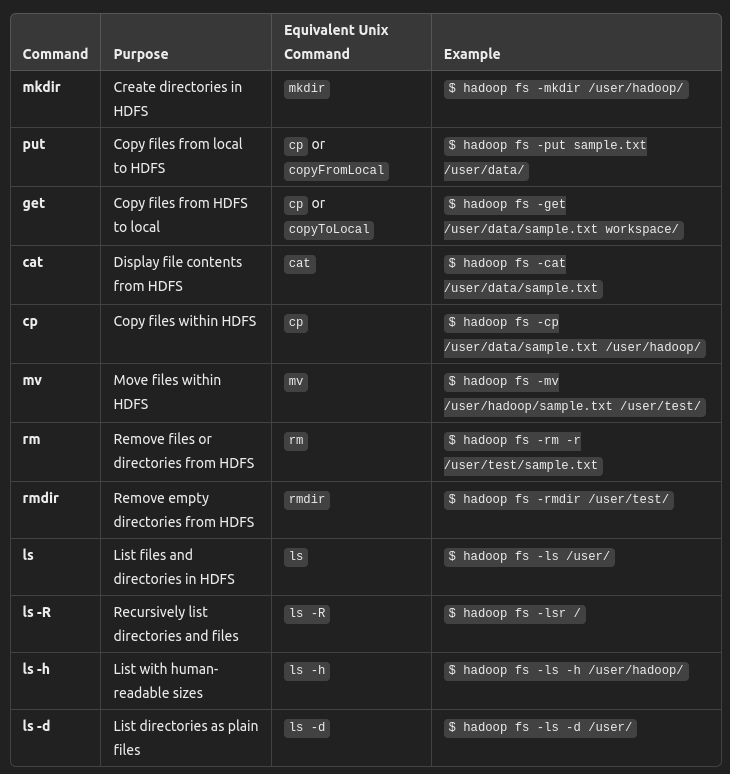
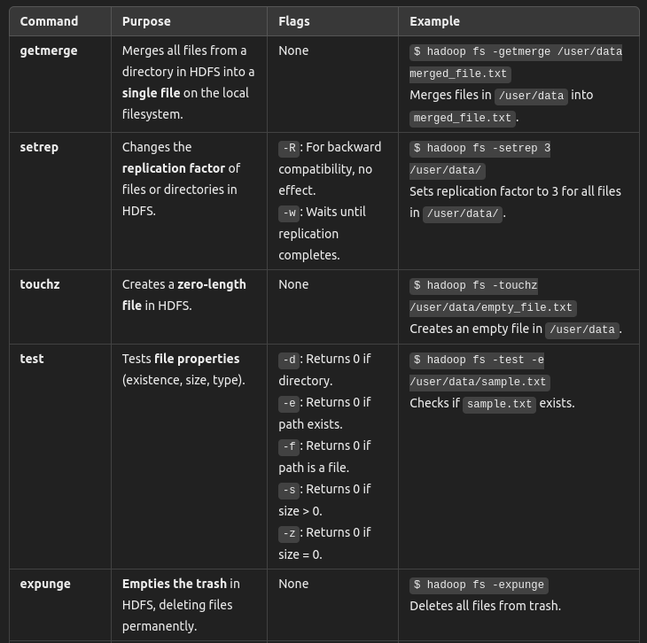
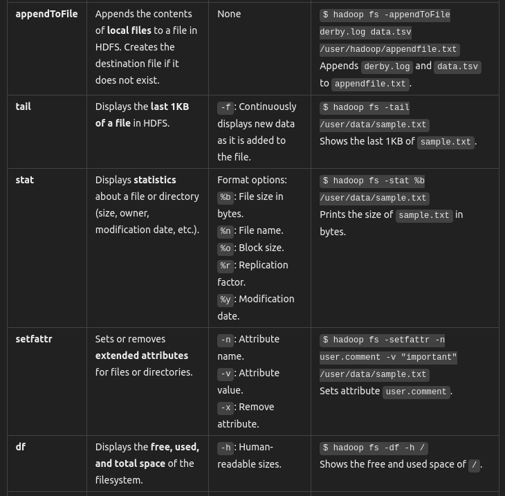
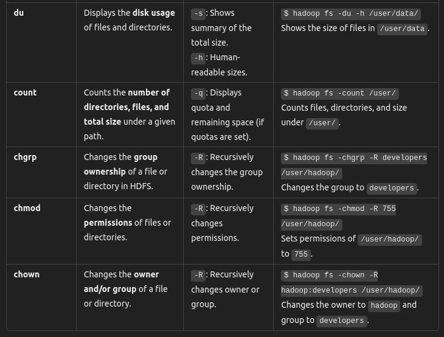

HDFS Commands
===============

help
------

Hadoop filesystem help

```hadoop fs -help```

mkdir
--------

make directory 

Creates new directories in HDFS

```hadoop fs -mkdir [-p] /user/hadoop/```

-p flag: 

* This option prevents failure if the directory already exists.
* It also creates parent directories automatically if they don’t exist.


ls
----


```hadoop fs -ls [-d] [-h] [-R] <path>```

* **-d  ::**   
Lists directories as plain files. This option helps avoid listing the contents of the directory and just shows the directory itself.
* **-h  ::**  
Human-readable sizes, such as KB, MB, or GB instead of raw bytes (e.g., "10M" instead of "10485760").
* **-R  ::**   
Recursively lists all the files and directories inside a given path.

**Output Format of ls:**

Directory Entry:

```permissions - userId groupId sizeOfDirectory modificationDate directoryName```

Example
```drwxr-xr-x - hadoop supergroup 4096 2024-10-30 12:00 /user/hadoop```


File Entry:

```permissions numberOfReplicas userId groupId sizeOfFile modificationDate filename```

Examples
```-rw-r--r-- 3 hadoop supergroup 10485760 2024-10-30 14:20 /user/hadoop/data.txt```


put
----------

Copies files from the local filesystem to HDFS.

Equivalent to: Unix cp or Hadoop’s -copyToLocal command.

```hadoop fs -put [-f] [-p] <localsrc> ... <dst>```

Example
```hadoop fs -put [-f] [-p] sample.txt /user/data/```

* **-f (force):**
Overwrites the destination file if it already exists.
* -**p (preserve):**
Preserves access and modification times, ownership, and permissions


get
----------

Copies files from HDFS to the local filesystem

Equivalent to: Unix cp or Hadoop’s -copyToLocal command.

```hadoop fs -get <src> <localdst>```

Example
```hadoop fs -get /user/data/sample.txt workspace/```


cat
-------

Displays the contents of a file stored in HDFS.

```hadoop fs -cat /user/data/sample.txt```


cp
---

Copies files within HDFS (from one directory to another).

```hadoop fs -cp /user/data/sample.txt /user/hadoop```

mv
-----

Moves a file from one directory to another within HDFS.

```hadoop fs -mv /user/hadoop/sample.txt /user/test/```


rm
-----

Deletes files from HDFS

```hadoop fs -rm [-f] [-r|-R] [-skipTrash] <src>```

* **-f (force):**
Suppresses error messages if the file does not exist.
* **-r or -R (recursive):** 
Deletes directories and their contents recursively.
* **-skipTrash:**
Immediately deletes files without sending them to the trash (if trash is enabled).


rmdir:
-------

Deletes empty directories from HDFS.

```hadoop fs -rmdir <directory>```


Commands Covered Till NOW
===========================




Some More Commands
====================

Not that relevant 

Just give a quick read below 







