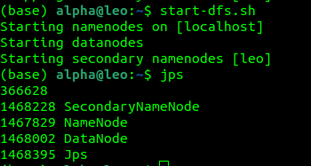
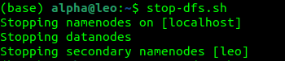

Hadoop Setup 
=================


We'll install Hadoop 3.3.1 and Hive 3.1.2 (compatible with each other).
And they only works with Java 8 

Prerequisites 
----------------

Java verion - OpenJDK 8  (Current setup doesn't work with Java 11 and 17)

OS - Ubuntu 22.04 LTS


Install OpenJDK 8:

```
sudo apt-get update
sudo apt-get install -y openjdk-8-jdk
```

Set Java 8 as the Default Java Version using the below command if other versions of java are also installed on your system:

```
sudo update-alternatives --config java
```

Follow the prompts to select Java 8 from the list.

Verify the Change:

```
java -version
```


Hadoop Download
----------------- 

```
wget https://archive.apache.org/dist/hadoop/common/hadoop-3.3.1/hadoop-3.3.1.tar.gz
```

```
tar -xvzf hadoop-3.3.1.tar.gz
```

```
sudo mv hadoop-3.3.1 /opt/hadoop
```

Hive Download 
----------------

```
wget https://archive.apache.org/dist/hive/hive-3.1.2/apache-hive-3.1.2-bin.tar.gz
```

```
tar -xvzf apache-hive-3.1.2-bin.tar.gz
```

```
sudo mv apache-hive-3.1.2-bin /opt/hive
```

Set Environment Variables
-----------------------------

```
nano ~/.bashrc
```

Add the following lines to the end of the file:

```
export JAVA_HOME=/usr/lib/jvm/java-8-openjdk-amd64
export HADOOP_HOME=/opt/hadoop
export HIVE_HOME=/opt/hive
export PATH=$JAVA_HOME/bin:$HADOOP_HOME/bin:$HADOOP_HOME/sbin:$HIVE_HOME/bin:$PATH
```


Apply the changes:

```
source ~/.bashrc
```


Configure Hadoop
------------------

Configure Core Settings: Edit the Hadoop core-site.xml file

```
nano /opt/hadoop/etc/hadoop/core-site.xml
```

Add the following content:

```
<configuration>
  <property>
    <name>fs.defaultFS</name>
    <value>hdfs://localhost:9000</value>
  </property>
</configuration>
```


Configure HDFS Settings: Edit hdfs-site.xml:

```
nano /opt/hadoop/etc/hadoop/hdfs-site.xml
```

Add the following content:

```
<configuration>
  <property>
    <name>dfs.replication</name>
    <value>1</value>
  </property>
</configuration>
```


Format the Hadoop Filesystem:

```
hdfs namenode -format
```


Enable SSH and Install SSH Client
---------------------------------------

```
sudo apt-get update
sudo apt-get install -y openssh-server openssh-client
```

```
sudo systemctl start ssh
sudo systemctl enable ssh
```

Configure Passwordless SSH for Hadoop
----------------------------------------

Generate SSH keys (if not already generated):

```
ssh-keygen -t rsa -P '' -f ~/.ssh/id_rsa
```

Copy the SSH key to localhost and the Hadoop nodes

```
cat ~/.ssh/id_rsa.pub >> ~/.ssh/authorized_keys
chmod 600 ~/.ssh/authorized_keys
```

Ensure SSH Agent is running:

```
eval "$(ssh-agent -s)"
ssh-add ~/.ssh/id_rsa
```

Test passwordless SSH:
If successful, this should not ask for a password.

```
ssh localhost
```

Exit afterwords 

```
exit
```


Update Hadoop Configuration
--------------------------------

```
nano /opt/hadoop/etc/hadoop/hadoop-env.sh
```

Add the below configs in the file 

NOTE:: PLEASE ADD YOUR USERNAME IN PLACE OF 'alpha'

```
export HDFS_NAMENODE_USER=alpha
export HDFS_DATANODE_USER=alpha
export HDFS_SECONDARYNAMENODE_USER=alpha
export JAVA_HOME=/usr/lib/jvm/java-8-openjdk-amd64
```

NOTE:: PLEASE ADD YOUR USERNAME IN PLACE OF 'alpha'


Start the Hadoop services:
---------------------------------

```
start-dfs.sh
```

Verify Hadoop is Running
-----------------------------

You should see processes like NameNode, DataNode, and SecondaryNameNode running.

```
jps
```



The Jps command is a Java Virtual Machine (JVM) Process Status tool. It shows the Java processes currently running on your system. Here, it confirms that the HDFS services (NameNode, DataNode, SecondaryNameNode) are running.

For Stopping the Hadoop services:
---------------------------------

```
stop-dfs.sh
```




Now Explaining what all we have done and is running
-----------------------------------------------------------

When we run start-dfs.sh, we're starting the Hadoop Distributed File System (HDFS), which is the storage layer of Hadoop. 

1. Namenode
    Role: The NameNode is the master node in HDFS.
    Task it performs:  It manages the file system namespace and keeps metadata about the files.

2. DataNode
    Role: The DataNode is the worker node in HDFS.
    Task it performs:  It stores the actual file data (in the form of blocks) on the local disk.
   
4. SecondaryNameNode
    Role: The SecondaryNameNode is a helper process for the NameNode.
    Task it performs:  It periodically merges the edit logs with the fsimage to prevent the NameNode from growing too large. (Edit logs: incremental changes, fsimage: snapshot of the file system metadata)

   Please note that the SecondaryNameNode is not a backup for the NameNode. If the NameNode fails, you cannot failover to the SecondaryNameNode automatically.

