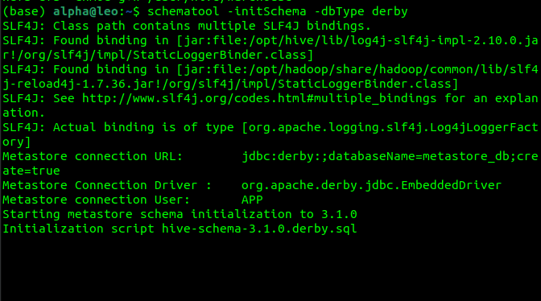
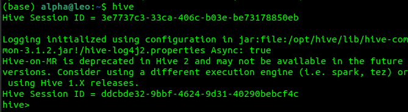
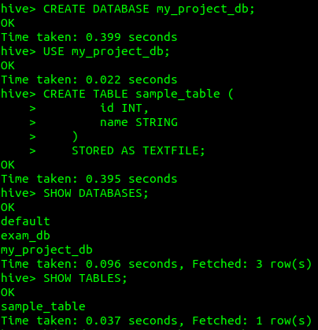
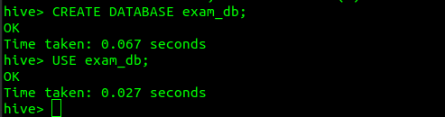
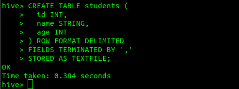

Hive
=================

Apache Hive is a data warehouse tool built on top of Hadoop that enables users to perform SQL-like queries on large datasets stored in HDFS. It is particularly useful for those familiar with SQL who want to analyze and process large datasets without learning complex MapReduce programming. Hive translates SQL queries (HiveQL) into MapReduce jobs or other execution engines like Tez and Spark.

Key Features of Hive
---------------------

1. SQL-like Query Language (HiveQL): Similar to SQL but designed for Hadoop.
2. Data Warehousing: Manages large datasets with tools like partitions and bucketing.
3. Integration with Hadoop Ecosystem: Runs on HDFS and integrates with other tools like Pig, Oozie, and Kafka.
4. Supports Multiple File Formats: Such as CSV, Parquet, ORC, and Avro.
5. Extensible: Users can write UDFs (User Defined Functions) to extend Hive’s capabilities.


Hive Setup
---------------------

BEFORE PROCEEDING WITH THE BELOW DOC MAKE SURE HADOOP SETUP IS DONE

BEFORE PROCEEDING WITH THE BELOW DOC MAKE SURE HADOOP SETUP IS DONE

1. Create a Warehouse Directory in HDFS:

```
hdfs dfs -mkdir -p /user/hive/warehouse
hdfs dfs -chmod g+w /user/hive/warehouse
```
This created the directory for Hive tables.

2. Initialize the Hive Metastore: Hive uses Derby by default as its metastore. We need to initialize it.

```
schematool -initSchema -dbType derby
```




We have set up the database schema for Hive's metastore above.


3. Run hive 

```
hive
```




Now we have the Hive shell for table creation and querying. 


Commands 
--------------------

We performed a Project for a BigData Submission
Below commands were performed for that 

1. Create a database


    CREATE DATABASE my_project_db;

2. Use the database


    USE my_project_db;

3. Create tables in this database


    CREATE TABLE sample_table (
        id INT,
        name STRING
    )
    STORED AS TEXTFILE;
    
4. Verify the database


    SHOW DATABASES;
    SHOW TABLES;



5. Below command is ran outside the Hive Shell

Check table Location in HDFS 

    hdfs dfs -ls /user/hive/warehouse/my_project_db.db/


Commands (IGNORE THIS SECTION)
---------------------------------

Below commands were for the exam practice, you can try them if you want 

1. Show Database 

```
SHOW DATABASES;
```


2. Create and Use a Database

```
CREATE DATABASE exam_db;
USE exam_db;
```




3. Create a Table

Create a simple students table to store ID, name, and age

```
CREATE TABLE students (
  id INT,
  name STRING,
  age INT
) ROW FORMAT DELIMITED 
FIELDS TERMINATED BY ',' 
STORED AS TEXTFILE;
```



Explanation:
* ROW FORMAT DELIMITED: Data will be separated by a delimiter (comma in this case).
* STORED AS TEXTFILE: The data will be stored in plain text format (you can also use ORC, Parquet, etc.).


4. Insert Data into the Table

INSERT INTO students VALUES (1, 'Alice', 22), (2, 'Bob', 24);

WIP ......
