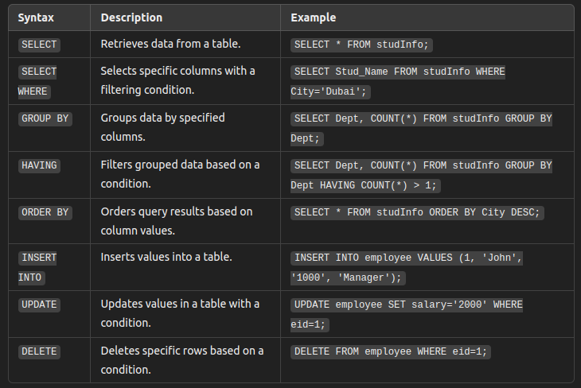

Hive Commands
================

General Hive Commands
----------------------------

These are the commands used to set up and manage the Hive infrastructure, such as databases and tables.

HiveQL 
---------------------------

Below commands are used to query and manipulate data inside the tables once the infrastructure is in place.

